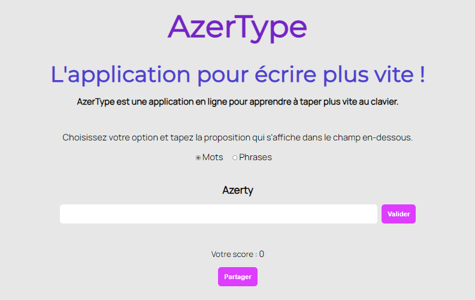

# COURS CODE BASES

## Description

Ce projet a pour but de vous faire découvrir les bases du langage de programmation JavaScript : sa syntaxe, sa logique de programmation.

## À l’issue de ce cours, vous serez capable de :

1. manipuler des données avec JavaScript ;
2. écrire un fichier JavaScript ;
3. faire interagir JavaScript avec votre page web ;
4. créer un formulaire de saisie de données.

## Instruction

1. Nom du chapitre 1[Lien vers branche](https://github.com/RodrigueCalimia/cours-code-base) 
1.1. Nom du chapitre 1.1[Lien vers branche](https://github.com/RodrigueCalimia/cours-code-base) 
2. Nom du chapitre 2[Lien vers branche](https://github.com/RodrigueCalimia/cours-code-base) 
2.1. Nom du chapitre 2.1[Lien vers branche](https://github.com/RodrigueCalimia/cours-code-base) 